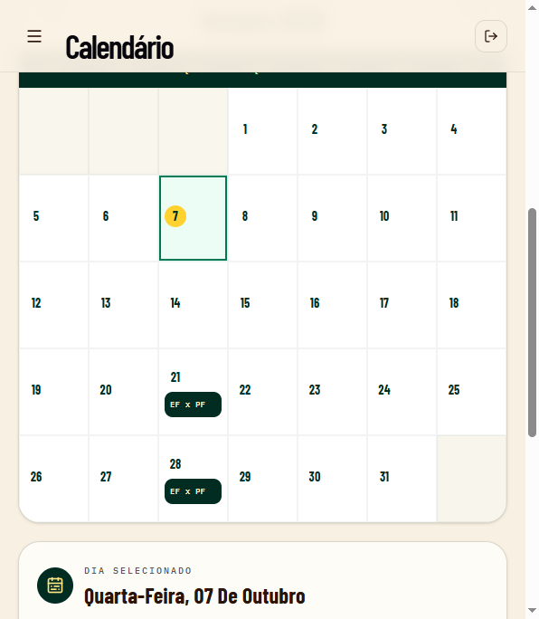
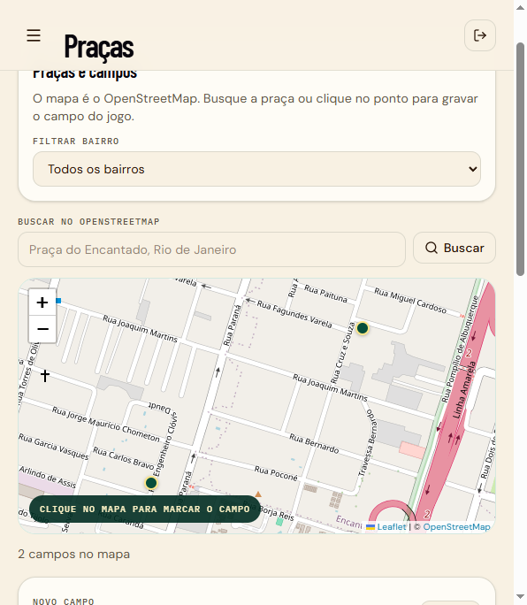
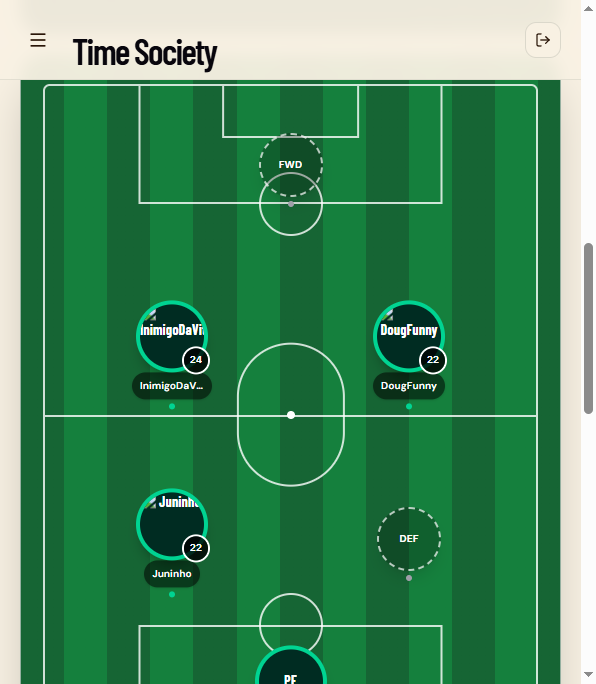

# BairroFut API

> API do BairroFut para o futebol de bairro: times, atletas, calendário, escalação, relatórios e estatísticas de partida. A tabela do Campeonato Brasileiro fica no frontend, em outra fonte.

## Check-in rápido

- Calendário de jogos e escalação: prontos (`/api/CalendarioJogo`, `/api/EscalacaoJogo`).
- Relatório de jogadores, com data da partida: `GET /api/Relatorio/jogadores`.
- Estatísticas no estilo de confronto (chutes, chutes a gol, posse, escanteios, faltas, cartões): `GET /api/Relatorio/estatisticas` e `POST /api/Relatorio/salvar-estatistica`.
- Ainda falta odds, feed ao vivo e a classificação do campeonato de bairro exposta no painel.

## Sobre o projeto

O **BairroFut** é a API do futebol de bairro: times, atletas, calendário, escalação, relatório de jogadores e estatísticas de partida.

O projeto está em evolução contínua e serve como laboratório para aplicar boas práticas de API, organização em camadas, autenticação e persistência de dados.

## Funcionalidades

- Cadastro e gerenciamento de bairros, times e jogadores;
- Vínculo de jogadores aos times e consulta de elenco/histórico;
- Criação de campeonatos, inscrições de times e definição de grupos;
- Organização de rodadas e agendamento de partidas;
- Registro de placares, reagendamentos e eventos de partida;
- Consulta de súmula e artilharia do campeonato;
- Geração e consulta de classificação;
- Cadastro/login de usuários com autenticação JWT;
- Verificação de saúde da API e da conexão com o banco.

## Calendário, mapa e escalação

O painel junta a agenda do bairro, o mapa dos campos e a escalação do time.

### Calendário

Em **Calendário** o mês mostra os jogos já marcados. Cada dia com partida traz o confronto. Ao abrir o dia, dá para ver os times, o horário, o campo e mudar o status (confirmado, adiado, realizado ou cancelado).

O jogo só ganha um pino no mapa quando, no agendamento, a praça é escolhida na lista ou no mapa. O texto do local, sozinho, não posiciona o ponto.



### Mapa das praças

Em **Praças** o mapa é o OpenStreetMap. Não usa chave do Google. A busca encontra a praça ou o endereço e preenche nome, endereço e coordenadas. Também dá para clicar no mapa e gravar o campo.

Os campos ficam na tabela `pracas`, ligada ao bairro. O jogo do calendário guarda essa praça em `calendario_jogos.praca_id`. A API cria essas colunas ao subir.



### Escalação

Em **Time Society** a escalação é montada em cima do campo. A formação (por exemplo 1-2-2-1) define as posições. O jogador entra no ponto vago, o banco lista quem ficou de fora e **Salvar escalação** grava a escalação no jogo escolhido do calendário.



## Tecnologias

- **.NET 8 / ASP.NET Core Web API**
- **PostgreSQL**
- **Dapper** e **Npgsql**
- **JWT Bearer Authentication**
- **BCrypt** para proteção de senhas
- **Swagger / OpenAPI** para documentação da API em desenvolvimento
- **Docker** e configuração preparada para deploy no Render
- **Leaflet** e **OpenStreetMap** no mapa das praças e no calendário

## Organização do código

```text
Controllers/   Endpoints HTTP da API
Services/      Regras e orquestração da aplicação
Repositories/  Queries e acesso ao PostgreSQL
Interfaces/    Contratos de serviços e repositórios
Modelos/       Modelos de domínio, requests e responses
ORM/           Contexto de conexão com o banco de dados
```

## Pré-requisitos

- [.NET SDK 8](https://dotnet.microsoft.com/download/dotnet/8.0)
- [Node.js](https://nodejs.org/) (o painel React fica em `client/`)
- PostgreSQL

## Como executar localmente

1. Clone o repositório e entre na pasta do projeto.

2. Crie o arquivo de configuração local a partir do exemplo:

```bash
copy appsettings.example.json appsettings.json
```

3. Preencha em `appsettings.json` a conexão PostgreSQL e uma chave JWT segura.

4. Instale as dependências do painel (só na primeira vez, ou quando o `package.json` mudar):

```bash
cd client
npm install
cd ..
```

5. Suba a API e o painel juntos:

```bash
dotnet run
```

O `dotnet run` inicia a API em `http://localhost:5027` e o Vite em `http://localhost:5174`. A raiz da API redireciona para o painel quando o Vite estiver pronto. O Vite encaminha `/api` para a API local, então o navegador fala com um único endereço de desenvolvimento.

No Render, a imagem Docker gera o painel e a API publica os dois no mesmo endereço. A raiz abre o painel; `/api` continua na API. Por isso o link de produção deixa de responder 404 na página inicial.

Swagger, só da API:

```text
http://localhost:5027/swagger
```

> A porta pode variar conforme a configuração do ambiente.

## Configurações necessárias

| Configuração | Finalidade |
| --- | --- |
| `ConnectionStrings:Postgres` | String de conexão com o banco PostgreSQL. |
| `Jwt:Key` | Chave usada para assinar os tokens JWT. Deve ter ao menos 16 bytes. |
| `Jwt:Issuer` e `Jwt:Audience` | Emissor e público esperado do token. |
| `Cors:AllowedOrigins` | Endereços do front-end autorizados a consumir a API. |
| `ApiFutebol:ApiKey` | Chave opcional para integração com a API Futebol. |

Para publicação, também podem ser utilizadas variáveis de ambiente, por exemplo:

```text
ConnectionStrings__Postgres=...
Jwt__Key=...
CORS_ALLOWED_ORIGINS=https://seu-front.com
PORT=8080
```

## Principais endpoints

Os endpoints protegidos exigem um token JWT no cabeçalho `Authorization: Bearer <token>`.

| Recurso | Exemplos de rotas |
| --- | --- |
| Saúde | `GET /health`, `GET /health/db` |
| Bairros | `POST /api/Bairro/cadastrar-bairro`, `GET /api/Bairro/listar-bairros` |
| Times | `POST /api/Time/cadastrar-time`, `GET /api/Time/listar-times` |
| Jogadores | `POST /api/Jogador/cadastra-jogador`, `GET /api/Jogador/buscar-jogadores` |
| Campeonatos | `POST /api/Campeonato/cadastrar-campeonato`, `GET /api/Campeonato/listar-campeonatos` |
| Rodadas | `POST /api/Rodada/cadastrar-rodada`, `GET /api/Rodada/listar-rodadas-campeonato/{campeonatoId}` |
| Partidas | `POST /api/Partida/cadastrar-partida`, `PUT /api/Partida/registrar-resultado/{id}` |
| Eventos | `POST /api/PartidaEvento/cadastrar-partida-evento`, `GET /api/PartidaEvento/listar-artilharia/{campeonatoId}` |
| Classificação | `GET /api/Classificacao/listar-classificacao/{campeonatoId}` |
| Praças | `GET /api/Praca/listar`, `POST /api/Praca/cadastrar` |
| Calendário | `GET /api/CalendarioJogo/listar`, `POST /api/CalendarioJogo/cadastrar` |
| Escalação do jogo | `POST /api/EscalacaoJogo/salvar-time`, `GET /api/EscalacaoJogo/listar-time/{partidaId}/{timeId}` |

Consulte o Swagger para a relação completa de rotas, parâmetros e modelos.

## Status

Este é um **projeto pessoal em desenvolvimento**. Novas funcionalidades, melhorias de validação, testes automatizados e documentação serão incorporados conforme a evolução do projeto.

---

Feito com dedicação para aprender, construir e acompanhar o futebol amador. ⚽
